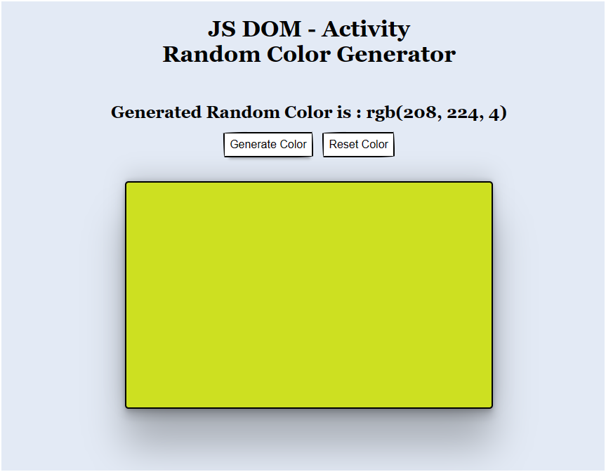

# JS DOM - Activity - Random Color Generator

## Overview

This project is a Random Color Generator built using JavaScript DOM. It allows users to generate a random background color for a div element and display its RGB value.

## Preview

## Features

- Users can generate a random background color by clicking the "Generate Color" button.
- The generated color is applied to the background of a div element.
- The RGB value of the generated color is displayed in a `<h2>` heading with the text "Generated Random Color is : rgb(value, value, value)".

## Technologies Used

- HTML
- CSS
- JavaScript DOM

## Usage

1. Open the `index.html` file in a web browser.
2. Click the "Generate Color" button to generate a random color.
3. The background color of the div will change to the generated color.
4. The RGB value of the generated color will be displayed in a `<h2>` heading below the button.

